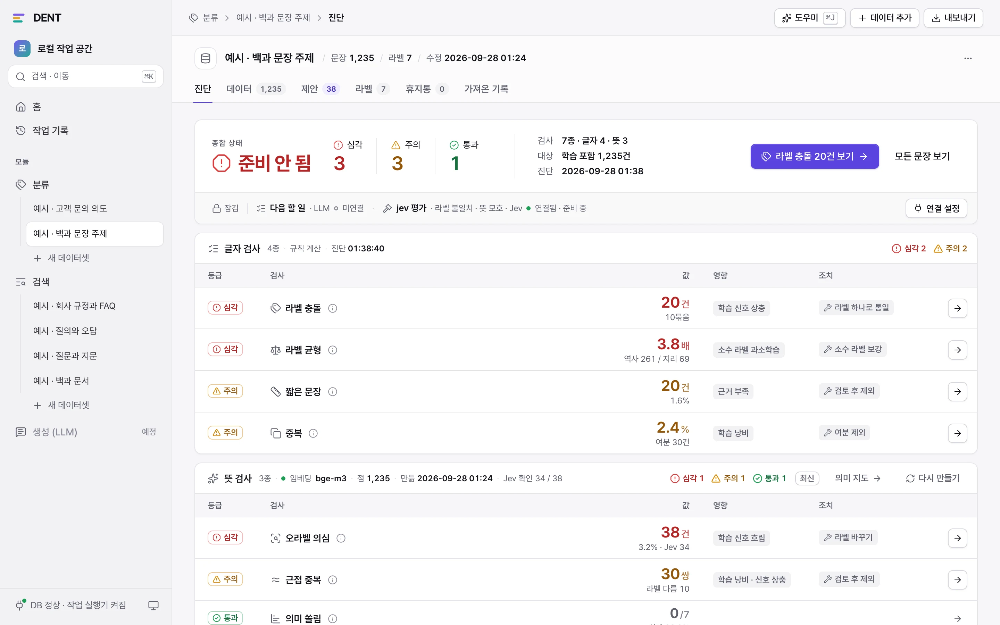
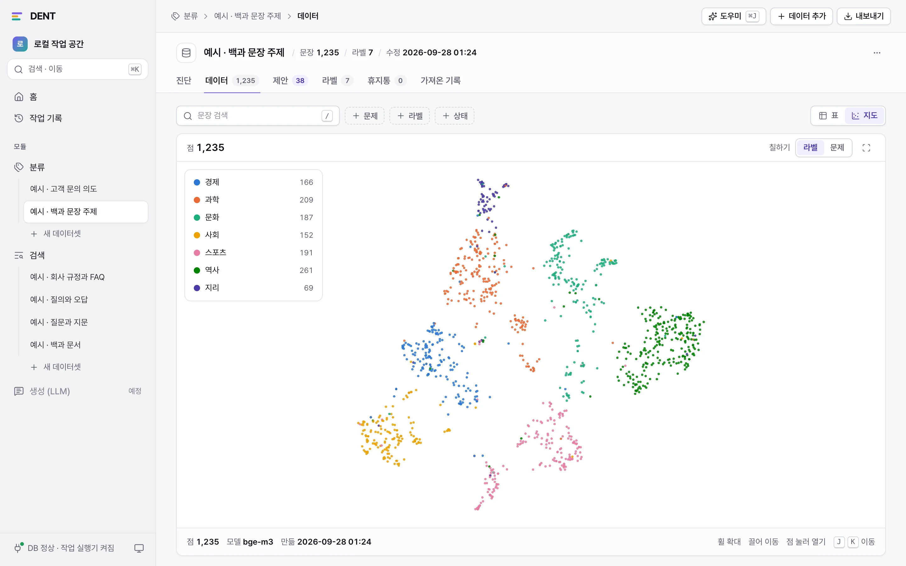
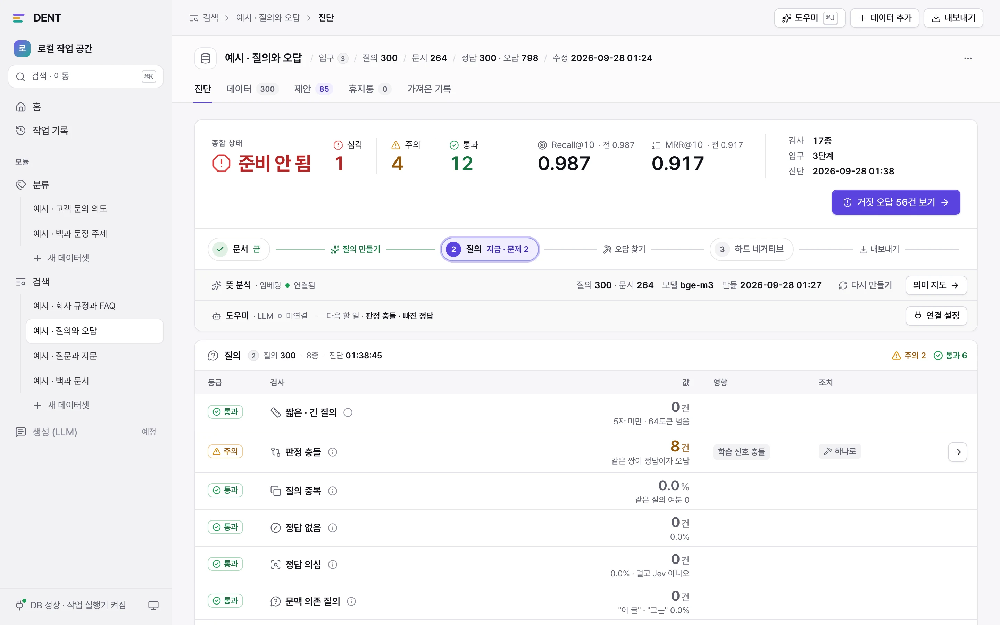

<div align="center">

# DENT

**Data Especially Needs Tidying**

분류 · 검색 모델의 학습 데이터를 화면에서 진단하고 고치는 로컬 도구

[](https://github.com/sophus1004/dent/actions/workflows/ci.yml)
[](LICENSE)
[](https://www.python.org/)
[](#지원-환경)

[시작하기](#시작하기) · [주요 기능](#주요-기능) · [실행과 종료](#실행과-종료) · [내장 모델](#내장-모델) · [개발 원칙](docs/principles.md)

<br>

<picture><source media="(prefers-color-scheme: dark)" srcset="docs/images/classification-diagnosis-dark.webp"></picture>

</div>

## 시작하기

```bash
git clone https://github.com/sophus1004/dent.git
cd dent
uv sync
pnpm --dir web install && pnpm --dir web build
uv run dent
```

실행되면 브라우저가 <http://127.0.0.1:8000>을 열고 터미널은 돌아옵니다. 문제를 일부러 심은 예시 데이터셋 6개(분류 2 · 검색 4)가
들어 있어 바로 해 볼 수 있습니다. 종료할 때는 `uv run dent stop`입니다.

- **필요한 것:** [uv](https://docs.astral.sh/uv/)(Python 3.12가 없으면 uv가 받습니다) · Node.js · [pnpm](https://pnpm.io/)
- **DB는 준비하지 않아도 됩니다:** PostgreSQL 18 + [pgvector](https://github.com/pgvector/pgvector)가 함께 설치되어 처음 실행할 때 `storage/pgdata`에 만듭니다.
- **처음 실행할 때:** 내장 모델(임베딩 · 판정 모델)을 올릴지 묻습니다. Enter만 누르면 '올리지 않음'입니다([내장 모델](#내장-모델)).

## 특징

모델을 바꾸기 전에 데이터를 먼저 봅니다.

1. **가져오기** — CSV · TSV · 엑셀(xlsx) · 허깅페이스 데이터셋
2. **진단** — 중복 · 라벨 충돌 · 오라벨 · 의미 쏠림 · 거짓 오답을 등급(통과 · 주의 · 심각)으로, **결론 → 문제 → 고치기** 순서로 보여 줍니다
3. **고치기** — 판단이 필요 없는 것은 규칙으로, 문장 하나하나의 판정은 판정 모델로, 둘 다 애매한 것만 LLM으로 고칩니다
4. **내보내기** — 학습과 평가에 바로 쓰는 파일(jsonl · csv · BEIR)

- **이 PC 안에서:** `127.0.0.1`에서만 열리고 로그인이 없습니다. 내장 모델을 쓰면 문장이 PC 밖으로 나가지 않습니다.
- **모두 되돌릴 수 있게:** 모든 고치기는 되돌릴 수 있습니다. 영구 삭제는 사람이 휴지통을 비울 때뿐입니다.
- **AI가 만든 것은 가려 둡니다:** 새로 만든 데이터는 출처(`synthetic`)로 표시하고, 내보내는 파일에도 출처 칸을 넣습니다.

<table>
  <tr>
    <td width="50%"><picture><source media="(prefers-color-scheme: dark)" srcset="docs/images/classification-map-dark.webp"></picture></td>
    <td width="50%"><picture><source media="(prefers-color-scheme: dark)" srcset="docs/images/retrieval-flow-dark.webp"></picture></td>
  </tr>
  <tr>
    <td><b>의미 지도</b> · 문장을 뜻으로 놓고 라벨이나 문제로 칠합니다. 점을 누르면 그 문장이 열립니다</td>
    <td><b>검색 흐름</b> · 문서 → 질의 → 하드 네거티브 가운데 지금 할 일과 그 단계의 검사, 기준 검색 점수</td>
  </tr>
</table>

## 주요 기능

### 분류 (`classification`)

| 단계 | 하는 일 |
|---|---|
| 가져오기 | 칸 맞추기(문장 · 라벨) 뒤 빈 문장 · 빈 라벨 줄은 건너뛰고, 공백만 다른 문장은 같은 문장으로 봅니다 |
| 진단 | 중복 · 라벨 충돌(같은 문장, 다른 라벨) · 짧은 문장 · 라벨 균형 |
| 뜻 분석 | 임베딩으로 근접 중복 · 오라벨 의심(교차 검증 분류기 + 판정 모델 확인) · 의미 쏠림을 찾고 의미 지도를 그립니다 |
| 제안 | 오라벨 의심을 [수락] · [유지]로 정합니다. 수락하기 전에는 데이터가 바뀌지 않습니다 |
| 도우미 | 진단을 읽고 라벨 충돌 → 오라벨 → 짧은 문장 → 중복 → 근접 중복 순서로 고칩니다 |
| 새 문장 | 라벨 균형이 모자라면 LLM이 만들고, 이미 있는 문장과 뜻이 거의 같은 것은 버리고, 판정 모델이 라벨을 확인한 것만 더합니다 |
| 내보내기 | 학습 jsonl(`text` · `label` · `label_text` · `source`) · 학습 표(csv) · 라벨 목록(`id2label` · `label2id`) |

### 검색 (`retrieval`)

원본 모양 다섯 가지를 받습니다: 문서만 · 질의와 정답 · 질문과 지문과 답 · 질의와 정답과 오답 · 질의와 문서와 점수.
모양에 따라 **문서 → 질의 → 하드 네거티브** 흐름의 어느 단계에서 시작할지 정해지고, 화면은 지금 할 일을 한 줄로 보여 줍니다.

| 단계 | 하는 일 |
|---|---|
| 문서 정리 | 깨진 글자 되돌리기 · 반복 구간(서명 · 꼬리말 · 연락처) 떼기 · 같은 문서 합치기 · 목차 · 표만 있는 청크 가르기 |
| 문서 나누기 | 구조(제목 줄 · 번호 단위) → 줄 → 문장 순서로 최대 토큰 안의 청크로 나누고, 청크마다 구획 경로를 머리말로 붙입니다. 판정은 답이 든 청크로 옮깁니다 |
| 질의 만들기 | 청크마다 LLM이 질의를 만들고 모양 · 문맥 의존 · 같은 질의 · 되찾기 순위 · 판정 모델로 거릅니다. 허락 전에 청크 5개로 시험하고 비용을 어림합니다 |
| 정답 확인 | 판정 충돌 · 정답 없는 질의 · 빠진 정답 · 정답 의심을 판정 모델과 LLM으로 봅니다 |
| 오답 찾기 | 기준 검색 순위에서 하드 네거티브를 고르고, 정답만큼 가깝거나 답을 담은 문서는 뺍니다 |
| 뜻 분석 | 근접 중복 · 주제 쏠림 · 기준 검색 점수(Recall@10 · MRR@10) |
| 내보내기 | 학습 jsonl(FlagEmbedding · bge-m3 모양, 교사 점수 포함) · 학습 표(sentence-transformers csv) · 평가 BEIR zip · 코퍼스 zip(색인용 학습 글과 정리 규칙) |

### 두 모듈에 공통

- **LLM 도우미:** 채팅이 아닙니다. 진단을 읽고 규칙 → 판정 모델 → LLM 순서로 고치며, 그 과정을 스스로 묻고 답하는 말로 실시간 창에 보이고
  보고로 끝납니다. 남은 문제는 사람이 골라 [AI로 고치기]를 누릅니다. 바꾼 것은 카드 하나 또는 실행 전체 단위로 되돌립니다.
- **데이터 추가:** 있던 데이터셋에 파일을 더하면 진단을 처음부터 다시 잽니다. 검색은 더한 문서에만 질의를 만들고,
  문서 풀이 늘었으니 모든 질의의 오답을 다시 찾습니다. 이미 나눈 긴 원문을 다시 넣어도 되살리지 않고 답이 든 청크에 판정을 붙입니다.
- **작업 기록 · 알림:** 가져오기 · 분석 · 도우미 · 내보내기는 작업 실행기가 하나씩 처리하고 진행률과 남은 시간을 보입니다.
- **내장 예시 데이터:** 문제를 심은 예시와 정답지를 함께 넣어 두었습니다. 처음 실행할 때 한 번 자동으로 들어오고, 지워도 다시 들어오지 않습니다.
  지운 예시는 [새 데이터셋] 첫 단계에서 골라 다시 넣을 수 있습니다. 이미 데이터셋이 있는 DB에 붙이면 넣지 않습니다.

## 실행과 종료

| 명령 | 하는 일 |
|---|---|
| `uv run dent` | 실행합니다. 내장 모델을 묻고, 실행될 때까지 보여 준 뒤 터미널을 돌려줍니다(뒤에서 계속 돎, 창을 닫아도 됨) |
| `uv run dent stop` | 종료합니다. 어느 터미널에서든 됩니다. 창을 닫아 남은 프로세스 · DB도 정리합니다 |
| `uv run dent status` | 실행 중인지 · 주소 · 실행한 지 얼마 · 서버와 모델 상태(모델을 받는 중이면 진행) |
| `uv run dent logs` | 로그를 이어서 봅니다. `Ctrl+C`는 보기만 멈추고 DENT는 계속 돕니다 |

| 옵션 | 뜻 |
|---|---|
| `-y` | 묻지 않고 지난번에 고른 내장 모델로 실행합니다. 터미널이 아닐 때(스크립트 등)도 묻지 않습니다 |
| `--no-browser` | 실행된 뒤 브라우저를 열지 않습니다 |
| `--foreground` | 뒤로 보내지 않고 이 터미널에서 돕니다(개발용). `Ctrl+C`나 창 닫기로 종료합니다 |

- **이미 실행 중일 때** `uv run dent`를 다시 치면 [브라우저 열기 · 종료 · 다시 실행] 가운데 고릅니다.
- 종료할 때는 API 서버 · 작업 실행기 · 내장 모델 서버 · 내장 DB를 차례로 종료합니다. 하던 작업은 다음에 실행할 때 이어서 합니다.
- 실행할 때 설정 · storage 폴더 · DB 연결 · pgvector · 테이블 버전을 차례로 확인하고, 안 되면 무엇을 하면 되는지 한 문장으로 알립니다.
  실행하지 못하면 까닭과 로그(`storage/logs/dent.log`)의 마지막 줄을 보여 줍니다. 업데이트한 뒤에도 실행할 때 테이블을 스스로 올립니다.

## 모델 연결

| 모델 | 쓰임 | 없으면 |
|---|---|---|
| 임베딩 (OpenAI 방식 `/embeddings`, 예: `BAAI/bge-m3`) 또는 내장 | 뜻 분석 · 오답 찾기 · 근접 거르기 | 실행되지만 이 기능만 미룸 |
| 판정 모델 Jev (TypeSafe AI) 또는 내장 | 문장 라벨 · 질의와 문서 판정 | 실행되지만 판정 없이 동작 |
| LLM (OpenAI · Anthropic · Google · xAI · vLLM) | 도우미 · 질의 만들기 · 새 문장 | 실행되지만 이 기능만 못 씀 |

화면의 [연결 설정]에서 주소와 모델(LLM은 공급자와 API 키도)을 저장하면 다시 실행할 필요 없이 바로 쓰입니다.
API 키는 DB에만 두고 화면에는 앞뒤 네 글자만 보입니다. 홈 맨 위의 모델 칸에서 세 모델의 상태를, 옆의 시스템 칸에서
DB · 테이블 · 저장 공간 · 작업 실행기를 봅니다.

## 내장 모델

임베딩과 판정 모델은 서버를 따로 두지 않고 DENT가 함께 띄울 수 있습니다. 모델 서버를 관리하지 않아도 되고, 문장이 PC 밖으로 나가지 않습니다.
LLM은 내장하지 않습니다.

| 역할 | 모델 | 라이선스 | 파일 |
|---|---|---|---|
| 임베딩 | [BAAI/bge-m3](https://huggingface.co/BAAI/bge-m3) (dense 1,024차원) | MIT | 약 2.1GB |
| 판정 (Jev 방식) | [convaiinnovations/laya](https://huggingface.co/convaiinnovations/laya) (체크포인트 3개) | Apache-2.0 | 약 2.2GB |

`uv run dent`를 치면 모델마다 올릴 곳과 파일을 묻습니다. 화살표로 고르고 Enter로 정합니다.

```
◆  임베딩 · bge-m3 · 2.1 GB · 올릴 곳
│  ● GPU 0         RTX 4090 · 여유 20.1 / 24.0 GB   지난번
│  ○ GPU 1         RTX 4090 · 여유 23.5 / 24.0 GB
│  ○ CPU           16코어 · 여유 41.2 / 64.0 GB
│  ○ 올리지 않음   연결 설정의 서버를 씀
└  ↑↓ 고르기 · Enter 확인 · Esc 남은 것 모두 지난번대로 실행
```

- **올릴 곳:** 이 PC에 실제로 있는 장치만 보입니다. NVIDIA GPU는 번호마다, Apple GPU, AMD GPU(Linux), CPU, 그리고 올리지 않음.
  고른 장치가 없거나 메모리가 모자라면 다른 장치로 몰래 바꾸지 않고 실패로 알립니다.
- **파일:** '받기'는 허깅페이스에서 커밋을 고정해 받고 sha256을 맞춘 뒤 `storage/models/<이름>/`에 파일 그대로 둡니다(허깅페이스 캐시는 쓰지 않습니다).
  '이 PC의 폴더'는 이미 받아 둔 폴더(DENT가 받은 모양이나 허깅페이스 저장소를 그대로 받은 모양)를 sha256으로 확인하고 복사하지 않고 그 자리에서 씁니다.
- **모델 패키지:** PyTorch · transformers · laya가 없으면 설치를 묻고, 이 PC에 맞는 판(NVIDIA CUDA · AMD ROCm · Apple · CPU)을
  골라 고정한 버전으로 받습니다. DENT의 다른 패키지 버전은 바꾸지 않습니다.
- **다음에 실행할 때:** 고른 것을 기억해 두어 Enter만 누르면 됩니다. Esc는 남은 질문을 모두 지난번대로 하고 바로 실행합니다.

모델 서버는 `127.0.0.1`의 `PORT`+1 · `PORT`+2에서 뜹니다. 모델을 받거나 불러오는 동안에도 DENT는 바로 열리고,
터미널과 홈의 모델 칸에 진행이 보입니다. 내장 모델을 올린 역할은 연결 설정에서 잠깁니다(저장한 외부 연결은 지우지 않으므로
다음에 '올리지 않음'을 고르면 다시 쓰입니다). 모델 이름이 같으면(`BAAI/bge-m3`) 외부 서버로 계산해 둔 임베딩 캐시를 그대로 씁니다.

## 지원 환경

| OS | DENT · 내장 DB | 내장 모델을 올릴 곳 |
|---|---|---|
| macOS (Apple Silicon) | 됨 | Apple GPU · CPU |
| Linux (x86_64 · ARM64) | 됨 | NVIDIA GPU · AMD GPU · CPU |
| Windows (x64) | 됨 | NVIDIA GPU · CPU |

- Intel Mac과 Windows ARM은 필요한 패키지(PyTorch · 의미 지도의 numba)가 나오지 않아 설치되지 않습니다.
- 올릴 때마다 GitHub Actions가 세 OS에서 설치 · 검사 · 테스트 · 실행과 종료를 확인합니다(위 '확인' 배지).
  내장 모델을 CPU에 올려 보는 확인은 모델 파일을 받으므로 손으로 돌립니다.

## 설정

<details>
<summary><b>설정 값 (<code>.env</code>, 모두 선택)</b></summary>

필요한 값만 적습니다: `cp .env.example .env` 뒤 쓸 줄의 `#`을 지웁니다. `.env`는 커밋하지 않습니다.

| 이름 | 뜻 | 기본 |
|---|---|---|
| `DATABASE_URL` | 외부 PostgreSQL 주소 (`postgresql+asyncpg://…`) | 비움 → 내장 DB |
| `TEST_DATABASE_URL` | 테스트 전용 외부 DB. `DATABASE_URL`과 달라야 합니다 | 비움 → 테스트가 임시 내장 DB |
| `STORAGE_DIR` | 올린 파일 · 내보낸 파일 · 로그 · 내장 DB · 모델 파일을 두는 폴더 | `./storage` |
| `PORT` | 화면 포트. 주소는 `127.0.0.1`로 고정입니다. 내장 모델은 바로 다음 두 포트를 씁니다 | `8000` |
| `HF_TOKEN` | 비공개 · 동의가 필요한 허깅페이스 데이터셋을 가져올 때 | — |
| `LOG_LEVEL` | 로그 수준 | `INFO` |

외부 모델 서버의 주소와 키는 `.env`에 적지 않고 화면의 [연결 설정]에서 저장합니다. 내장 모델은 실행할 때 고릅니다.

</details>

<details>
<summary><b>외부 PostgreSQL 쓰기</b></summary>

이미 운영하는 PostgreSQL(pgvector 확장 필요)을 쓰려면, 관리자 계정으로 사용자와 데이터베이스를 만들고 `vector` 확장을 켭니다.

```sql
CREATE ROLE dent LOGIN PASSWORD 'change-me';
CREATE DATABASE dent OWNER dent;
\c dent
CREATE EXTENSION vector;
```

`.env`에 `DATABASE_URL`을 적고 테이블을 올립니다. 외부 DB의 테이블은 DENT가 스스로 바꾸지 않으므로, 업데이트한 뒤
"테이블을 새 버전으로 바꿔야 합니다"가 보이면 이 명령을 다시 실행합니다.

```bash
uv run alembic upgrade head
```

내장 DB와 외부 DB 사이의 데이터는 스스로 옮기지 않습니다. 옮기려면 `pg_dump` · `pg_restore`를 씁니다(둘 다 PostgreSQL 18이면 그대로 됩니다).

</details>

## 삭제

먼저 `uv run dent stop`으로 종료합니다. DENT가 만드는 것은 모두 `storage/`(`STORAGE_DIR`) 안에 있습니다.

| 폴더 | 들어 있는 것 |
|---|---|
| `storage/pgdata/` | 내장 DB (데이터셋 · 고친 기록 · 임베딩 캐시) |
| `storage/models/` | 받은 모델 파일 · 지난번 선택 |
| `storage/uploads/` · `storage/exports/` | 올린 파일 · 내보낸 파일 |
| `storage/logs/` | 로그 |

- **모델 파일만:** `storage/models/<이름>/`을 지웁니다. '이 PC의 폴더'로 고른 파일은 DENT가 지우지 않습니다.
- **모델 패키지만:** `uv sync`를 하면 잠금 파일에 없는 PyTorch 등이 빠집니다(다음에 내장 모델을 고르면 다시 묻습니다).
- **모두:** 종료한 뒤 저장소 폴더를 지웁니다. 외부 PostgreSQL을 썼다면 그 DB는 따로 지웁니다.

## 개발

```bash
uv run pytest                                        # 테스트 (TEST_DATABASE_URL이 없으면 임시 내장 DB를 실행해서 씁니다)
uv run ruff check --fix . && uv run ruff format .    # 검사와 모양
pnpm --dir web build                                 # 화면 층 규칙 검사 + 타입 검사 + 빌드
pnpm --dir web dev                                   # 화면 개발 서버 (5173, API는 8000으로 넘깁니다)
uv run python -m dent.server --reload                # API 서버만 (개발용)
uv run python -m dent.worker                         # 작업 실행기만 (개발용)
```

테스트는 외부 서버 대신 가짜 응답을 쓰므로 임베딩 · Jev · LLM 없이, DB도 따로 준비하지 않고 돕니다.
API 서버 · 작업 실행기를 따로 띄우면 내장 DB는 실행되지만 종료하지는 않습니다(다음에 실행할 때 그 서버에 그대로 붙습니다).

```
src/dent/
├── system/           모든 모듈이 쓰는 바탕: 설정 · DB · 작업 실행기 · 파일 읽기 · 외부 모델 연결 · 도우미 엔진 · 내보내기
├── modules/
│   ├── classification/   분류: 표 · 진단 · 뜻 분석 · 도우미 · 내보내기 · 내장 예시
│   └── retrieval/        검색: 표 · 글 규칙 · 흐름 · 질의 만들기 · 오답 찾기 · 도우미 · 내보내기 · 내장 예시
├── api/              시스템 API, /api/v1 모으기, 예외 → HTTP
├── launcher.py       실행 명령 (uv run dent · stop · status · logs)
├── supervisor.py     뒤에서 도는 관리 프로세스 (DB · 서버들을 띄우고 지켜보고 종료한다)
├── model_server.py   내장 모델 서버 (임베딩 · 판정 모델)
├── server.py · worker.py
web/src/              화면 (Vue 3 · shadcn-vue · Tailwind v4). system/ · modules/ 구분은 백엔드와 같습니다
migrations/           테이블 버전 (Alembic)
tests/                src를 따라갑니다
scripts/examples/     내장 예시 데이터의 원고와 만들기
scripts/launch_check.py   실행과 종료 확인 (GitHub Actions가 Windows · macOS · Linux에서 돌림)
```

모듈은 서로를 모르고, 두 모듈 이상이 쓰는 기능은 `system`에 한 번만 둡니다.
새 모듈은 세 군데(API 라우터 · 모델 모음 · 작업 실행기)와 화면 목록 한 칸에 붙입니다.
아키텍처(층과 경계) · 기능이 따르는 원칙 · 바이브코딩(AI와 함께 만드는) 규칙 · 검증 방식은 [개발 원칙](docs/principles.md)에 있습니다.

## 현재 상태

- 모듈: 분류 · 검색. 생성(`generation`) 모듈은 예정입니다(아래 '로드맵').
- 학습 · 평가 분할(train · valid · test)은 하지 않습니다. 모든 데이터를 한 덩어리로 정리하고, 내보내는 파일의 출처 칸으로 AI가 만든 것을 가릅니다.
- 판정 모델의 신뢰도를 한국어 사람 판정으로 다시 재는 일, 가까운 벡터 찾기 인덱스(ANN)는 아직 하지 않았습니다.
- 설치 · 테스트 · 실행과 종료(내장 DB 포함)는 macOS · Linux에서 확인했습니다. Windows는 아직 확인 중입니다(Windows의 내장 DB는 소켓 대신 `127.0.0.1`의 빈 포트로 붙습니다).

## 로드맵

계획이라 순서와 내용은 바뀔 수 있습니다.

### 생성(LLM) 학습 데이터 — 다음 모듈 (`generation`)

분류 · 검색과 같은 흐름(진단 → 고치기 → 내보내기)으로 LLM을 학습시키는 데이터를 다룹니다.

- **데이터 모양:** 지시와 응답(SFT) · 여러 턴 대화 · 선호 쌍(같은 지시에 고른 응답과 버린 응답, DPO 모양)
- **진단:** 같은 · 거의 같은 지시, 지시 종류의 쏠림, 너무 짧거나 끊긴 응답, 형식이 깨진 대화,
  응답에 남은 개인정보 · 연락처, 고른 응답과 버린 응답이 같거나 거의 같은 선호 쌍
- **고치기:** 판정 모델과 LLM으로 응답을 판정하고, 모자란 종류의 지시를 새로 만들어 채웁니다(출처 `synthetic`으로 가려 둠)
- **내보내기:** 학습 도구가 바로 읽는 대화 jsonl

## 라이선스

[Apache License 2.0](LICENSE)
